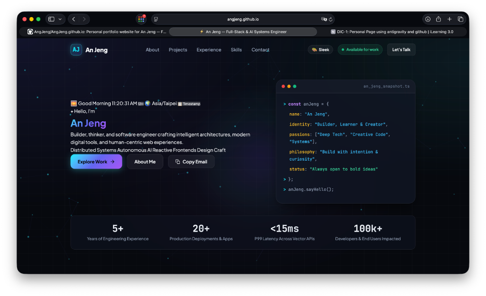

# An Jeng — Personal Portfolio Website

> 🌐 **Live Demo**: [https://angjeng.github.io/](https://angjeng.github.io/)



A modern, responsive, dark-mode personal website for **An Jeng** (Full-Stack & AI Systems Engineer), built with pure semantic HTML5, modern CSS3 (Custom Design System & Glassmorphism), and Vanilla ES6+ JavaScript.

---

## ✨ Features

- **⚡ Zero Build Steps**: No npm installs, Webpack, Vite, or external bundlers required. Works out-of-the-box in any modern browser.
- **🎨 Modern Dark Aesthetic**: Tailored obsidian & deep indigo palette, glassmorphic cards, glowing neon borders, ambient cursor lighting, and subtle micro-animations.
- **📱 Responsive & Accessible**: Mobile-first architecture with fluid typography (`Plus Jakarta Sans` & `JetBrains Mono`), semantic HTML5 tags, and accessible contrast ratios.
- **🎯 Interactive Showcase**:
  - **Category Filtering**: Filter projects across `All`, `AI & Agents`, `Full-Stack`, and `Cloud & Systems`.
  - **Case Study Modals**: Deep-dive modals explaining project architecture, challenges solved, and quantifiable performance outcomes.
  - **Live Terminal Card**: Code preview displaying status, core stack, and focus area.
  - **Experience Timeline**: Interactive career milestones with quantified bullet points and technology badges.
  - **1-Click Email Copy**: Instant copy with feedback toast.
  - **Interactive Contact Form**: Instant feedback, validation, and simulated submission.

---

## 🎁 0916 Bonus Features Implemented

- 🌅 **Time-Aware Greeting**: Automatically changes to Good Morning / Afternoon / Evening according to visitor's local hour.
- 🔄 **12H / 24H Clock Toggle**: Real-time ticking digital clock with 1-click 12H/24H format switcher.
- 🌍 **Automatic Timezone Detection**: Identifies and displays visitor's local timezone (e.g., `Asia/Taipei`, `America/Los_Angeles`).
- 📋 **Copy Timestamp**: 1-click to copy current ISO timestamp with toast feedback.
- ✏️ **Live Editable Profile**: Interactive editing mode directly on the page to customize Name, Role, Location, and Bio.
- 💾 **`localStorage` Persistence**: Automatically preserves customized profile, 12H/24H format preference, and theme selection across browser refreshes.
- 🌌 **Interactive Particle Constellation Background**: 60fps HTML5 canvas rendering glowing nodes connected with proximity lines and reacting to cursor repulsion.
- 🎨 **Sleek Obsidian vs. Cyberpunk 2077 Theme Toggle**: Instant switch between glassmorphic obsidian and vibrant Cyberpunk neon aesthetic with scanline effects.
- 📱 **Mobile-First Responsive Design**: Adaptive layout optimized across phones, tablets, and widescreen displays.

---

## 🚀 Quick Start

### 1. Simple Local Preview
You can preview the site immediately using any static web server:

```bash
# Option A: Using Python 3
python3 -m http.server 8080

# Option B: Using Node.js (npx)
npx serve .
```

Then open `http://localhost:8080` or `http://localhost:3000` in your browser.

---

## 🛠 Customization

- **Contact Email**: Update the email address in `index.html` (`#emailDisplay`) and `script.js` (`const emailText = '...'`).
- **Social Links**: Replace the dummy URLs in `index.html` (GitHub, LinkedIn, Twitter/X, Substack) with your personal handles.
- **Projects**: Add, remove, or edit cards in `index.html` and their corresponding deep-dive data in `script.js` (`projectData` object).
- **Themes & Colors**: Adjust CSS variables in `style.css` under `:root` (e.g., `--accent-cyan`, `--accent-indigo`).

---

## 🌐 Free Instant Deployment

- **GitHub Pages**: Push this repository to GitHub, navigate to **Settings > Pages**, and select `main` branch root.
- **Vercel**: Run `npx vercel` or import the GitHub repo.
- **Netlify**: Drag-and-drop the directory into the Netlify dashboard.
